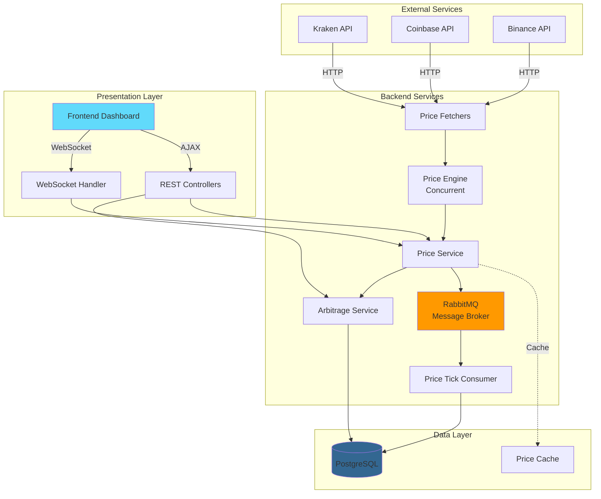
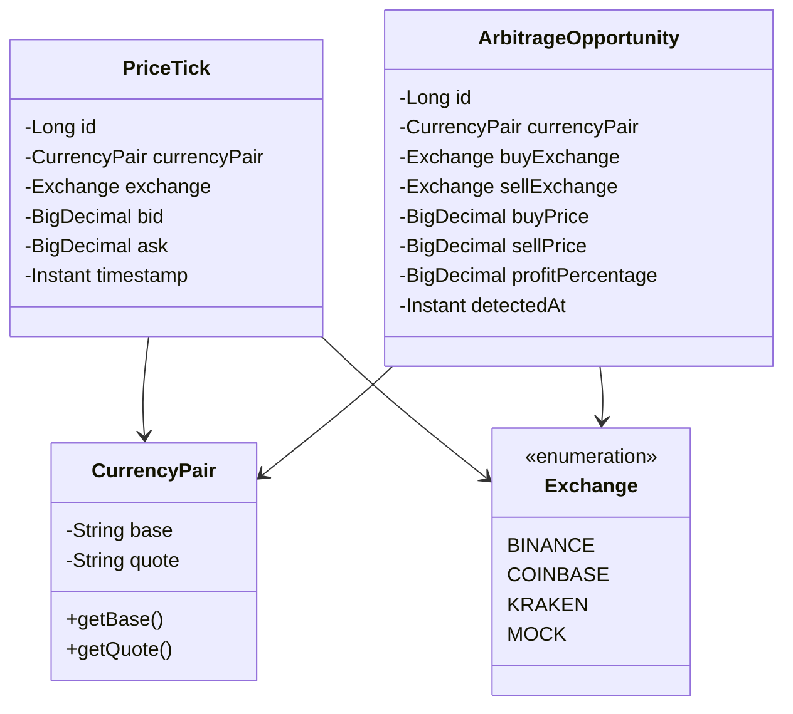
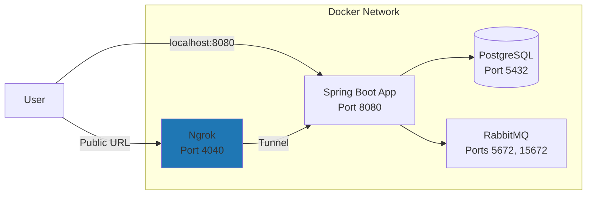

# Crypto Price Aggregator - System Design Document

> **Version**: 1.0  
> **Last Updated**: December 15, 2025  
> **Project**: Crypto Price Aggregator (CPA)

---

## Table of Contents

1. [System Overview](#system-overview)
2. [Architecture Design](#architecture-design)
3. [Component Design](#component-design)
4. [Data Design](#data-design)
5. [API Design](#api-design)
6. [Deployment Architecture](#deployment-architecture)
7. [Design Decisions & Trade-offs](#design-decisions--trade-offs)
8. [Scalability & Performance](#scalability--performance)
9. [Security Design](#security-design)

---

## 1. System Overview

### 1.1 Purpose
The **Crypto Price Aggregator (CPA)** is a real-time financial data aggregation system designed to:
- Fetch cryptocurrency prices from multiple exchanges (Binance, Coinbase, Kraken)
- Detect arbitrage opportunities across exchanges
- Provide a modern web dashboard for price monitoring
- Support external access via ngrok tunneling

### 1.2 Key Features
- **Multi-Exchange Integration**: Real-time data from 3+ major exchanges
- **Arbitrage Detection**: Automatic detection and persistence of profit opportunities
- **Event-Driven Architecture**: Asynchronous processing using RabbitMQ
- **Real-Time Updates**: WebSocket support with auto-refresh capabilities
- **Containerized Deployment**: Full Docker Compose setup with PostgreSQL, RabbitMQ, and ngrok
- **Premium Frontend**: Glassmorphism design with Chart.js visualizations

### 1.3 Technology Stack

#### Backend
- **Language**: Java 17
- **Framework**: Spring Boot 3.5.8
- **Build Tool**: Maven
- **Database**: PostgreSQL 15
- **Message Broker**: RabbitMQ 3
- **Containerization**: Docker & Docker Compose
- **Migration Tool**: Flyway
- **Testing**: JUnit 5, Mockito, Testcontainers

#### Frontend
- **Core**: HTML5, CSS3, JavaScript (ES6+)
- **Visualization**: Chart.js
- **Design Pattern**: Vanilla CSS with modern aesthetics

#### DevOps
- **CI/CD**: GitHub Actions
- **Deployment**: GitHub Pages (frontend), Docker (backend)
- **External Access**: Ngrok

---

## 2. Architecture Design

### 2.1 High-Level Architecture



### 2.2 Architectural Patterns

#### Layered Architecture
```
┌─────────────────────────────────────┐
│     Presentation Layer              │
│  (Controllers, WebSocket, Frontend) │
└─────────────────────────────────────┘
              ↓
┌─────────────────────────────────────┐
│      Service Layer                  │
│  (Business Logic, Orchestration)    │
└─────────────────────────────────────┘
              ↓
┌─────────────────────────────────────┐
│      Data Access Layer              │
│  (Repositories, JPA Entities)       │
└─────────────────────────────────────┘
              ↓
┌─────────────────────────────────────┐
│      Infrastructure Layer           │
│  (Database, Messaging, External)    │
└─────────────────────────────────────┘
```

#### Event-Driven Architecture
- **Producer**: `ManualPriceMessageProducer` publishes price ticks to RabbitMQ
- **Exchange**: Topic exchange for flexible routing
- **Queue**: Durable queues for reliable message delivery
- **Consumer**: `PriceTickConsumer` persists data to database
- **Benefits**: Decoupling, scalability, fault tolerance

### 2.3 Design Principles

#### SOLID Principles
1. **Single Responsibility**: Each service has one clear purpose
   - `PriceService`: Price data management
   - `ArbitrageService`: Arbitrage detection logic
   - `ManualConcurrentPriceEngine`: Concurrent fetching mechanics

2. **Open/Closed**: Extensible without modification
   - New exchanges can be added by implementing `PriceFetcher` interface
   - New arbitrage algorithms can extend `ArbitrageService`

3. **Liskov Substitution**: Interface-based design
   - All fetchers implement `PriceFetcher` interface
   - Can swap implementations without breaking code

4. **Interface Segregation**: Focused interfaces
   - `PriceFetcher` only defines `fetchPrice()`
   - `ArbitrageService` only defines arbitrage methods

5. **Dependency Inversion**: Depend on abstractions
   - Services depend on interfaces, not concrete implementations
   - Constructor injection for testability

---

## 3. Component Design

### 3.1 Core Components

#### 3.1.1 Price Fetching System

**ManualConcurrentPriceEngine**
```java
Purpose: Concurrent price fetching using ExecutorService
Pattern: Thread Pool Pattern
Key Features:
  - Fixed thread pool (configurable size)
  - Timeout handling (5 seconds)
  - Defensive coding against hanging requests
  - Future-based async computation
```

**PriceFetcher Interface**
```java
interface PriceFetcher {
    PriceTick fetchPrice(CurrencyPair pair);
    Exchange getExchange();
}

Implementations:
  - BinanceFetcher
  - CoinbaseFetcher
  - KrakenFetcher
  - MockPriceFetcher (for testing)
```

**PriceService**
```java
Responsibilities:
  - Orchestrate price fetching from multiple exchanges
  - Maintain latest price cache (in-memory)
  - Publish price ticks to RabbitMQ
  - Provide price query APIs

Key Methods:
  - fetchAllPrices(CurrencyPair): Fetch from all exchanges
  - getLatestPriceTicks(CurrencyPair): Get cached prices
  - getPriceHistory(CurrencyPair, limit): Query historical data
```

#### 3.1.2 Arbitrage Detection System

**ArbitrageService**
```java
Algorithm:
  1. Fetch latest prices from all exchanges
  2. Find minimum ask price (where to buy)
  3. Find maximum bid price (where to sell)
  4. Calculate profit: sellPrice - buyPrice
  5. Calculate profit percentage: (profit / buyPrice) * 100
  6. If profitable, persist to database

Financial Precision:
  - Uses BigDecimal for all calculations
  - RoundingMode.HALF_UP to prevent infinite decimals
  - Scale of 4 for profit percentage
```

#### 3.1.3 Messaging System

**RabbitMQ Configuration**
```yaml
Exchange: prices.topic
Queue: prices.queue
Routing Key: price.tick
Message Format: JSON (PriceTick)
Durability: Durable (survives broker restart)
Acknowledgment: Auto-acknowledge
```

**Flow**:
```
PriceService → RabbitTemplate → Exchange → Queue → Consumer → Database
```

#### 3.1.4 Data Persistence

**Repositories**
- `PriceTickRepository`: JPA repository for price data
- `ArbitrageRepository`: JPA repository for arbitrage opportunities

**Custom Queries**:
```java
// Find latest prices by exchange
findTopByCurrencyPair_BaseAndCurrencyPair_QuoteAndExchangeOrderByTimestampDesc()

// Find arbitrage opportunities
findByCurrencyPair_BaseAndCurrencyPair_QuoteOrderByDetectedAtDesc()
```

### 3.2 Configuration Components

#### SecurityConfig
- HTTP Basic Authentication
- CORS configuration for frontend
- Static resource serving
- CSRF disabled for REST APIs

#### WebConfig
- Resource handlers for frontend assets
- Path matching configuration

#### RabbitMqConfig
- Exchange, queue, and binding definitions
- Message converter (JSON)

#### JpaConfig
- Auditing enabled
- Custom naming strategy

### 3.3 Cross-Cutting Concerns

#### Logging
- SLF4J with Logback
- Structured logging with context
- Different levels: DEBUG, INFO, WARN, ERROR

#### Metrics & Monitoring
- Micrometer with Prometheus registry
- Custom metrics for arbitrage detection
- `@Timed` annotations on critical methods
- Spring Boot Actuator endpoints

#### Health Checks
- Custom health indicators
- Database connectivity check
- RabbitMQ connectivity check

#### Error Handling
- Global exception handler
- Graceful degradation for failed fetches
- Timeout handling for external APIs

---

## 4. Data Design

### 4.1 Domain Model



### 4.2 Database Schema

#### price_ticks Table
```sql
Columns:
  - id: BIGSERIAL PRIMARY KEY
  - base: VARCHAR(255) NOT NULL
  - quote: VARCHAR(255) NOT NULL
  - exchange: VARCHAR(255) NOT NULL
  - bid: NUMERIC(19,8) NOT NULL
  - ask: NUMERIC(19,8) NOT NULL
  - timestamp: TIMESTAMP NOT NULL

Constraints:
  - chk_bid_non_negative: bid >= 0
  - chk_ask_non_negative: ask >= 0
  - chk_bid_le_ask: bid <= ask

Indexes:
  - idx_price_ticks_pair_timestamp: (base, quote, timestamp DESC)
  - idx_price_ticks_exchange: (exchange)
```

#### arbitrage_opportunities Table
```sql
Columns:
  - id: BIGSERIAL PRIMARY KEY
  - base: VARCHAR(255) NOT NULL
  - quote: VARCHAR(255) NOT NULL
  - buy_exchange: VARCHAR(255) NOT NULL
  - sell_exchange: VARCHAR(255) NOT NULL
  - buy_price: NUMERIC(19,8) NOT NULL
  - sell_price: NUMERIC(19,8) NOT NULL
  - profit_percentage: NUMERIC(19,8) NOT NULL
  - detected_at: TIMESTAMP NOT NULL

Indexes:
  - idx_arb_pair_detected: (base, quote, detected_at DESC)
  - idx_arb_detected: (detected_at DESC)
```

### 4.3 Database Migration Strategy

**Flyway Versioning**:
- `V1__initial_schema.sql`: Base price_ticks table
- `V2__create_arbitrage_opportunities.sql`: Arbitrage table

**Benefits**:
- Version-controlled schema changes
- Automatic migration on startup
- Rollback capability
- Team synchronization

---

## 5. API Design

### 5.1 REST Endpoints

#### Price Controller

**GET /api/prices/{base}/{quote}**
```http
Description: Fetch current prices for a currency pair
Response: List<PriceTickDTO>
Example: GET /api/prices/BTC/USD
```

**GET /api/prices/{base}/{quote}/history**
```http
Description: Get historical prices
Query Params: limit (default: 100)
Response: List<PriceTickDTO>
```

**GET /api/prices/exchanges**
```http
Description: List all supported exchanges
Response: List<String>
```

#### Arbitrage Controller

**GET /api/arbitrage/{base}/{quote}**
```http
Description: Fetch arbitrage opportunities for a pair
Query Params: limit (default: 10)
Response: List<ArbitrageOpportunityDTO>
Example: GET /api/arbitrage/BTC/USD?limit=20
```

**POST /api/arbitrage/{base}/{quote}/detect**
```http
Description: Trigger arbitrage detection
Response: ArbitrageOpportunityDTO (if found)
Status: 200 OK or 204 No Content
```

### 5.2 WebSocket Endpoints

**STOMP Endpoint**: `/ws/prices`
```javascript
Subscribe to: /topic/prices/{base}/{quote}
Message Format: PriceTickDTO
Update Frequency: On price change (rate-limited)
```

### 5.3 Data Transfer Objects

```java
PriceTickDTO {
    exchange: String
    bid: BigDecimal
    ask: BigDecimal
    timestamp: Instant
}

ArbitrageOpportunityDTO {
    buyExchange: String
    sellExchange: String
    buyPrice: BigDecimal
    sellPrice: BigDecimal
    profitPercentage: BigDecimal
    detectedAt: Instant
}
```

---

## 6. Deployment Architecture

### 6.1 Docker Compose Setup



#### Service Dependencies
```yaml
Services:
  - db: PostgreSQL with health checks
  - rabbitmq: RabbitMQ with management UI
  - app: Spring Boot (depends on db, rabbitmq)
  - ngrok: Tunnel service (depends on app)

Health Checks:
  - Database: pg_isready command
  - RabbitMQ: rabbitmq-diagnostics ping
  - Retry strategy: 5 retries, 10s interval
```

### 6.2 Environment Configuration

**Profiles**:
- `dev`: Development mode (H2, verbose logging)
- `prod`: Production mode (PostgreSQL, optimized settings)

**Environment Variables**:
```bash
SPRING_DATASOURCE_URL=jdbc:postgresql://db:5432/cryptodb
SPRING_DATASOURCE_USERNAME=cryptouser
SPRING_DATASOURCE_PASSWORD=cryptopass
SPRING_RABBITMQ_HOST=rabbitmq
SPRING_RABBITMQ_PORT=5672
NGROK_AUTHTOKEN=<token>
```

### 6.3 Deployment Options

#### Local Development
```bash
docker compose up --build
Access: http://localhost:8080/frontend/index.html
```

#### GitHub Pages (Frontend Only)
```yaml
Workflow: .github/workflows/deploy-pages.yml
Trigger: Push to main branch
Artifact: frontend/ directory
URL: https://username.github.io/repo-name/
```

#### Production Hosting
- **Backend**: Render, Railway, Fly.io, AWS, GCP, Azure
- **Frontend**: GitHub Pages, Netlify, Vercel
- **Database**: Managed PostgreSQL (AWS RDS, etc.)
- **Messaging**: Managed RabbitMQ (CloudAMQP)

---

## 7. Design Decisions & Trade-offs

### 7.1 Concurrency Approach

**Decision**: Manual thread pool with `ExecutorService`

**Alternatives Considered**:
- Spring `@Async`: Simpler but less control
- Reactive Streams: Overkill for current scale
- CompletableFuture: Similar but more boilerplate

**Rationale**:
- Educational: Demonstrates low-level concurrency
- Control: Explicit timeout and error handling
- Performance: Efficient for I/O-bound tasks

**Trade-offs**:
- ✅ Fine-grained control
- ✅ Predictable resource usage
- ❌ More code than `@Async`
- ❌ Manual thread management

### 7.2 Messaging vs. Direct Persistence

**Decision**: Use RabbitMQ for asynchronous processing

**Alternatives**:
- Direct database writes: Simpler
- Kafka: More scalable but heavier

**Rationale**:
- Decoupling: Price fetching independent of persistence
- Fault tolerance: Messages survive failures
- Scalability: Can add more consumers
- Learning: Industry-standard pattern

**Trade-offs**:
- ✅ System resilience
- ✅ Better scalability
- ❌ Additional infrastructure
- ❌ Eventual consistency

### 7.3 In-Memory Cache

**Decision**: Simple `ConcurrentHashMap` for latest prices

**Alternatives**:
- Redis: External cache
- Caffeine: Sophisticated in-memory cache
- Database only: No cache

**Rationale**:
- Simplicity: No external dependencies
- Performance: Sub-millisecond reads
- Sufficient: Data refreshed every 5 seconds

**Trade-offs**:
- ✅ Low latency
- ✅ Simple implementation
- ❌ Not distributed (single instance only)
- ❌ Lost on restart

### 7.4 BigDecimal for Financial Calculations

**Decision**: Use `BigDecimal` for all monetary values

**Alternatives**:
- `double`/`float`: Faster but imprecise
- Cents-based integers: Limited precision

**Rationale**:
- Precision: No floating-point errors
- Standard: Industry best practice for finance
- Compliance: Regulatory requirements

**Trade-offs**:
- ✅ Exact arithmetic
- ✅ Arbitrary precision
- ❌ Slower than primitives
- ❌ More verbose code

### 7.5 Flyway vs. JPA Auto-DDL

**Decision**: Flyway for schema management

**Alternatives**:
- Hibernate auto-DDL: Automatic but risky
- Liquibase: More features but complex

**Rationale**:
- Control: Explicit schema changes
- Versioning: Track schema evolution
- Safety: No accidental production changes
- Team collaboration: Reviewable SQL

**Trade-offs**:
- ✅ Production-safe
- ✅ Version controlled
- ❌ Manual migration writing
- ❌ Extra configuration

---

## 8. Scalability & Performance

### 8.1 Current Performance Characteristics

**Throughput**:
- Price fetching: 3 exchanges in ~2-3 seconds (parallel)
- API response time: \<100ms (cached data)
- Database writes: ~1000 ticks/second (via RabbitMQ)

**Resource Usage**:
- Thread pool: 5 threads (configurable)
- Memory: ~500MB JVM heap
- Database connections: 10 (HikariCP pool)

### 8.2 Scaling Strategies

#### Horizontal Scaling
```
Load Balancer
     |
     |-----> Instance 1 (Fetcher + API)
     |-----> Instance 2 (Fetcher + API)
     |-----> Instance 3 (Consumer Only)

Shared: PostgreSQL, RabbitMQ
```

**Considerations**:
- Stateless design enables scaling
- Cache becomes distributed (need Redis)
- Database becomes bottleneck (read replicas)

#### Vertical Scaling
- Increase thread pool size
- Larger database instance
- More RabbitMQ consumers

#### Optimization Opportunities

**Caching**:
- Add Redis for distributed cache
- Cache arbitrage results (TTL: 30s)
- HTTP caching headers for frontend

**Database**:
- Partition price_ticks by timestamp
- Archive old data to cold storage
- Read replicas for queries

**Rate Limiting**:
- Per-exchange rate limits (avoid bans)
- Client-side rate limiting (protection)
- Adaptive backoff on failures

**WebSocket Optimization**:
- Only send updates on significant price changes (>0.1%)
- Batch updates (every 1-5 seconds)
- Limit concurrent connections

---

## 9. Security Design

### 9.1 Authentication & Authorization

**Current Implementation**:
- HTTP Basic Authentication
- Default credentials: `user` / `password`
- In-memory user store

**Production Recommendations**:
- OAuth 2.0 / OpenID Connect
- JWT tokens for stateless auth
- Role-based access control (RBAC)
- Database-backed user store

### 9.2 CORS Configuration

```java
Allowed Origins: http://localhost:8080, https://pranay-a-1.github.io
Allowed Methods: GET, POST, OPTIONS
Allowed Headers: *
Exposed Headers: *
Allow Credentials: true
```

### 9.3 Input Validation

**Currency Pair Validation**:
- Pattern: `^[A-Z]{3,6}$` (e.g., BTC, ETH, USDT)
- Prevents injection attacks

**Parameter Validation**:
- `@Valid` annotations on DTOs
- Bean Validation constraints
- Controller-level validation

### 9.4 Security Headers

**Recommended Headers** (not yet implemented):
```http
Content-Security-Policy: default-src 'self'
X-Content-Type-Options: nosniff
X-Frame-Options: DENY
X-XSS-Protection: 1; mode=block
Strict-Transport-Security: max-age=31536000
```

### 9.5 Secrets Management

**Current**:
- Environment variables (`.env` file)
- Docker secrets not used

**Production**:
- AWS Secrets Manager / HashiCorp Vault
- Encrypted environment variables
- Rotate ngrok tokens regularly
- No hardcoded secrets in code

### 9.6 External API Security

**Best Practices**:
- Use API keys (not included in requests currently)
- Implement rate limiting
- Validate SSL certificates
- Timeout on all external calls (5 seconds)

---

## Appendix

### A. Key Technologies Explained

**Spring Boot**: Opinionated framework for rapid Java application development

**RabbitMQ**: Message broker implementing AMQP protocol for async messaging

**Flyway**: Database migration tool with version control for schema changes

**Testcontainers**: Library for integration testing with real Docker containers

**BigDecimal**: Java class for arbitrary-precision decimal arithmetic

**ExecutorService**: Java concurrency utility for managing thread pools

### B. Common Interview Questions

**Q: Why did you choose Spring Boot?**
> Spring Boot provides a robust, production-ready framework with extensive ecosystem support. It offers dependency injection, auto-configuration, and seamless integration with databases, messaging systems, and security frameworks, significantly reducing boilerplate code.

**Q: How does your arbitrage detection work?**
> We fetch the latest prices from all exchanges, identify the minimum ask price (where to buy cheapest) and maximum bid price (where to sell highest). If `sellPrice > buyPrice`, we have an arbitrage opportunity. We use BigDecimal for precise financial calculations and persist opportunities to the database for analysis.

**Q: What is the purpose of RabbitMQ in your system?**
> RabbitMQ decouples price fetching from database persistence. When prices are fetched, they're published to a queue. Consumers independently persist them to the database. This provides fault tolerance (messages aren't lost), scalability (add more consumers), and improves responsiveness (fetching doesn't wait for DB writes).

**Q: How do you handle failures in external API calls?**
> We use a timeout (5 seconds) on all external calls via ExecutorService. Failed fetches are logged but don't crash the system. We use the "defensive coding" approach where futures are checked for cancellation, and execution exceptions are caught and logged. This ensures partial failures don't affect the entire system.

**Q: How would you scale this system to handle 1000 requests/second?**
> I would: (1) Add Redis for distributed caching, (2) Deploy multiple instances behind a load balancer, (3) Use database read replicas for query distribution, (4) Partition the price_ticks table by timestamp, (5) Implement connection pooling and async processing, (6) Add CDN for frontend assets, (7) Use container orchestration (Kubernetes) for auto-scaling.

**Q: Why use Docker Compose instead of Kubernetes?**
> Docker Compose is perfect for local development and small-scale deployments. It's simpler, has less overhead, and easier to debug. For production at scale, I would migrate to Kubernetes for features like auto-scaling, self-healing, rolling updates, and service discovery.

### C. Related Documentation

- [README.md](README.md): Project overview and setup instructions
- [PROJECT_STRUCTURE.md](PROJECT_STRUCTURE.md): Detailed file tree
- [DEPLOYMENT.md](DEPLOYMENT.md): Deployment guide
- [implementatonDocs/](implementatonDocs/): Phase-wise development logs

---

