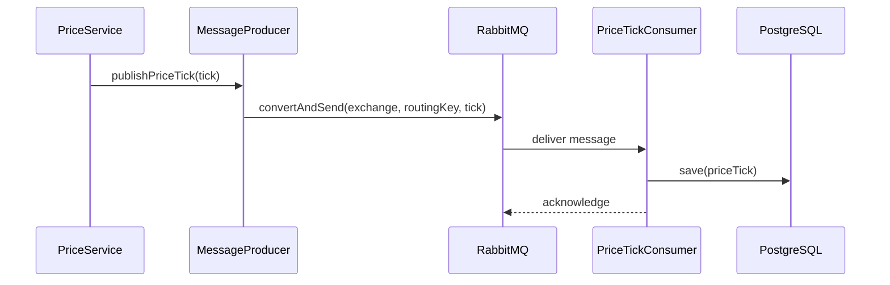

# Crypto Price Aggregator - Technical Deep Dive

> **Companion Document to**: [DESIGN.md](DESIGN.md)  
> **Focus**: Implementation details, code architecture, and design patterns  
> **Audience**: Technical interviewers and developers

---

## Table of Contents

1. [Service Layer Architecture](#service-layer-architecture)
2. [Concurrency Implementation](#concurrency-implementation)
3. [Messaging Architecture](#messaging-architecture)
4. [Data Persistence Strategy](#data-persistence-strategy)
5. [Configuration Management](#configuration-management)
6. [Testing Strategy](#testing-strategy)
7. [Code Quality & Best Practices](#code-quality--best-practices)

---

## 1. Service Layer Architecture

### 1.1 Service Interfaces

#### PriceFetcher Interface
```java
public interface PriceFetcher {
    /**
     * Fetch the current price for a given currency pair.
     * This method may throw unchecked exceptions for network failures.
     */
    PriceTick fetchPrice(CurrencyPair pair);
    
    /**
     * Get the exchange this fetcher represents.
     */
    Exchange getExchange();
}
```

**Design Rationale**:
- **Interface Segregation**: Single responsibility - just fetch prices
- **Polymorphism**: Each exchange implementation can have custom logic
- **Testability**: Easy to mock for unit tests
- **Extensibility**: New exchanges just implement this interface

**Implementations**:
1. **BinanceFetcher**: Uses Binance public API
2. **CoinbaseFetcher**: Uses Coinbase public API
3. **KrakenFetcher**: Uses Kraken public API
4. **MockPriceFetcher**: Generates random prices for testing

#### PriceService Interface
```java
public interface PriceService {
    /**
     * Fetch prices from all exchanges for the given pair.
     * Publishes results to RabbitMQ.
     */
    List<PriceTick> fetchAllPrices(CurrencyPair pair);
    
    /**
     * Get the latest cached prices for a currency pair.
     */
    Map<String, PriceTick> getLatestPriceTicks(CurrencyPair pair);
    
    /**
     * Get historical price data from database.
     */
    List<PriceTick> getPriceHistory(CurrencyPair pair, int limit);
}
```

### 1.2 Service Implementation Details

#### PriceServiceImpl

**Key Responsibilities**:
1. Orchestrate concurrent price fetching
2. Maintain in-memory cache of latest prices
3. Publish price updates to RabbitMQ
4. Provide query APIs for historical data

**Code Flow**:
```
fetchAllPrices() 
    ↓
ManualConcurrentPriceEngine.fetchPrices() [Parallel]
    ↓
Cache latest prices (ConcurrentHashMap)
    ↓
Publish to RabbitMQ (ManualPriceMessageProducer)
    ↓
Return results
```

**Caching Strategy**:
```java
// In-memory cache structure
private final Map<String, Map<String, PriceTick>> latestPricesCache;
// Key format: "BTC/USD" -> { "BINANCE": PriceTick, "COINBASE": PriceTick }

// Cache update logic
private void updateCache(CurrencyPair pair, List<PriceTick> ticks) {
    String key = pair.getBase() + "/" + pair.getQuote();
    Map<String, PriceTick> exchangeMap = new ConcurrentHashMap<>();
    
    for (PriceTick tick : ticks) {
        exchangeMap.put(tick.getExchange().name(), tick);
    }
    
    latestPricesCache.put(key, exchangeMap);
}
```

**Benefits**:
- ✅ Fast reads (no DB query)
- ✅ Thread-safe (`ConcurrentHashMap`)
- ✅ Automatic updates on each fetch
- ❌ Lost on restart (acceptable for this use case)

#### ArbitrageServiceImpl

**Algorithm Implementation**:
```java
public Optional<ArbitrageOpportunity> detectArbitrage(CurrencyPair pair) {
    // 1. Get latest prices from cache
    Map<String, PriceTick> latestTicks = priceService.getLatestPriceTicks(pair);
    
    // 2. Find minimum ask (where to buy cheapest)
    Optional<PriceTick> minAskTick = latestTicks.values().stream()
        .min((t1, t2) -> t1.getAsk().compareTo(t2.getAsk()));
    
    // 3. Find maximum bid (where to sell highest)
    Optional<PriceTick> maxBidTick = latestTicks.values().stream()
        .max((t1, t2) -> t1.getBid().compareTo(t2.getBid()));
    
    // 4. Calculate profit using BigDecimal
    PriceTick buyTick = minAskTick.get();
    PriceTick sellTick = maxBidTick.get();
    
    BigDecimal buyPrice = buyTick.getAsk();
    BigDecimal sellPrice = sellTick.getBid();
    
    if (sellPrice.compareTo(buyPrice) > 0) {
        BigDecimal profit = sellPrice.subtract(buyPrice);
        BigDecimal profitPercentage = profit
            .divide(buyPrice, 10, RoundingMode.HALF_UP)
            .multiply(BigDecimal.valueOf(100))
            .setScale(4, RoundingMode.HALF_UP);
        
        // 5. Create and persist opportunity
        ArbitrageOpportunity opportunity = new ArbitrageOpportunity(
            pair, buyTick.getExchange(), sellTick.getExchange(),
            buyPrice, sellPrice, profitPercentage, Instant.now()
        );
        
        return Optional.of(arbitrageRepository.save(opportunity));
    }
    
    return Optional.empty();
}
```

**Why This Approach?**:
- **Stream API**: Idiomatic Java 8+ code for min/max finding
- **Optional**: Explicit handling of missing data
- **BigDecimal**: Financial-grade precision
- **@Transactional**: Automatic rollback on exceptions
- **@Timed**: Micrometer metrics for monitoring

---

## 2. Concurrency Implementation

### 2.1 ManualConcurrentPriceEngine

**Purpose**: Demonstrates low-level concurrency without relying on Spring abstractions.

#### Thread Pool Configuration
```java
public class ManualConcurrentPriceEngine {
    private final ExecutorService executorService;
    private static final long FETCH_TIMEOUT_SECONDS = 5;
    
    public ManualConcurrentPriceEngine(int threadPoolSize) {
        this.executorService = Executors.newFixedThreadPool(threadPoolSize);
    }
}
```

**Why Fixed Thread Pool?**:
- **Predictable**: Bounded resource usage
- **Prevents overload**: Won't create unlimited threads
- **Reuses threads**: Efficient for repeated tasks

**Alternative**: `Executors.newCachedThreadPool()` - grows unbounded (risky)

#### Concurrent Fetch Implementation
```java
public List<PriceTick> fetchPrices(List<PriceFetcher> fetchers, CurrencyPair pair) {
    // 1. Create callable tasks
    List<Callable<PriceTick>> tasks = new ArrayList<>();
    for (PriceFetcher fetcher : fetchers) {
        tasks.add(() -> fetcher.fetchPrice(pair));
    }
    
    List<PriceTick> results = new ArrayList<>();
    
    try {
        // 2. Execute all tasks with timeout (CRITICAL!)
        List<Future<PriceTick>> futures = executorService.invokeAll(
            tasks, FETCH_TIMEOUT_SECONDS, TimeUnit.SECONDS
        );
        
        // 3. Collect results, handling cancellations
        for (Future<PriceTick> future : futures) {
            try {
                if (!future.isCancelled()) {
                    PriceTick tick = future.get();
                    if (tick != null) {
                        results.add(tick);
                    }
                }
            } catch (ExecutionException e) {
                log.error("Fetch failed: {}", e.getCause().getMessage());
            }
        }
    } catch (InterruptedException e) {
        Thread.currentThread().interrupt();
    }
    
    return results;
}
```

### 2.2 Concurrency Patterns Used

#### Pattern 1: Future-Based Parallelism
```
Submit Tasks → Execute Concurrently → Wait for Futures → Aggregate Results
```

#### Pattern 2: Timeout Protection
```java
invokeAll(tasks, 5, TimeUnit.SECONDS)
```
**Effect**: Tasks exceeding 5s are automatically cancelled.

**Why Important?**:
- Prevents "hanging requests" from blocking the system
- Ensures predictable SLA (response within 5 seconds)
- Protects against slow/unresponsive external APIs

#### Pattern 3: Partial Failure Handling
```java
// If one exchange fails, others still return
for (Future<PriceTick> future : futures) {
    try {
        // Process successful result
    } catch (ExecutionException e) {
        // Log and continue (don't fail entire operation)
    }
}
```

### 2.3 Thread Safety Considerations

**ConcurrentHashMap for Cache**:
```java
private final Map<String, Map<String, PriceTick>> latestPricesCache 
    = new ConcurrentHashMap<>();
```
- ✅ Thread-safe reads and writes
- ✅ No external synchronization needed
- ✅ High concurrency (segment-based locking)

**Immutable Domain Objects**:
```java
@Entity
public class PriceTick {
    // All fields are final or managed by JPA
    // No setters (except for JPA)
}
```
- ✅ No mutation after creation
- ✅ Safe for concurrent access
- ✅ Easier to reason about

---

## 3. Messaging Architecture

### 3.1 RabbitMQ Configuration

#### Exchange, Queue, and Binding
```java
@Configuration
public class RabbitMqConfig {
    public static final String EXCHANGE_NAME = "prices.topic";
    public static final String QUEUE_NAME = "prices.queue";
    public static final String ROUTING_KEY = "price.tick";
    
    @Bean
    public TopicExchange exchange() {
        return new TopicExchange(EXCHANGE_NAME);
    }
    
    @Bean
    public Queue queue() {
        return new Queue(QUEUE_NAME, true); // durable=true
    }
    
    @Bean
    public Binding binding(Queue queue, TopicExchange exchange) {
        return BindingBuilder.bind(queue)
            .to(exchange)
            .with(ROUTING_KEY);
    }
}
```

**Design Choices**:
- **Topic Exchange**: Flexible routing (can add pattern-based routing later)
- **Durable Queue**: Survives RabbitMQ restart
- **Single Routing Key**: Simple for now, can extend to `price.{exchange}.{pair}`

#### Message Converter
```java
@Bean
public Jackson2JsonMessageConverter messageConverter() {
    return new Jackson2JsonMessageConverter();
}
```
**Benefits**:
- Automatic Java ↔ JSON conversion
- Human-readable messages (easier debugging)
- Schema evolution support (add fields without breaking)

### 3.2 Producer Implementation

```java
@Component
public class ManualPriceMessageProducer implements PriceMessageProducer {
    private final RabbitTemplate rabbitTemplate;
    
    @Override
    public void publishPriceTick(PriceTick priceTick) {
        rabbitTemplate.convertAndSend(
            RabbitMqConfig.EXCHANGE_NAME,
            RabbitMqConfig.ROUTING_KEY,
            priceTick
        );
        log.debug("Published price tick: {}", priceTick);
    }
}
```

**RabbitTemplate Benefits**:
- Connection pooling (managed by Spring)
- Automatic retries (configurable)
- Transaction support (if needed)

### 3.3 Consumer Implementation

```java
@Component
public class PriceTickConsumer {
    private final PriceTickRepository repository;
    
    @RabbitListener(queues = RabbitMqConfig.QUEUE_NAME)
    public void consume(PriceTick priceTick) {
        log.debug("Consumed price tick: {}", priceTick);
        repository.save(priceTick);
        log.info("Persisted price tick for {} from {}",
            priceTick.getCurrencyPair(), priceTick.getExchange());
    }
}
```

**@RabbitListener Features**:
- Automatic deserialization (JSON → Java)
- Acknowledgment handling (auto-ack by default)
- Error handling (dead letter queue can be configured)
- Concurrency (can have multiple consumers)

### 3.4 Message Flow Diagram



### 3.5 Benefits of Async Processing

**Performance**:
- Price fetching doesn't wait for DB I/O
- Response time: ~2-3s (parallel fetch) vs. ~5-8s (if synchronous DB writes)

**Reliability**:
- Messages persist in queue (survive app crashes)
- Automatic retry on consumer failure
- Can replay messages if needed

**Scalability**:
- Add more consumers without changing producer
- Queue acts as buffer during traffic spikes
- Decoupled scaling (fetch vs. persist)

---

## 4. Data Persistence Strategy

### 4.1 JPA Entity Design

#### PriceTick Entity
```java
@Entity
@Table(name = "price_ticks")
public class PriceTick {
    @Id
    @GeneratedValue(strategy = GenerationType.IDENTITY)
    private Long id;
    
    @Embedded
    private CurrencyPair currencyPair;
    
    @Enumerated(EnumType.STRING)
    @Column(nullable = false)
    private Exchange exchange;
    
    @Column(nullable = false, precision = 19, scale = 8)
    private BigDecimal bid;
    
    @Column(nullable = false, precision = 19, scale = 8)
    private BigDecimal ask;
    
    @Column(nullable = false)
    private Instant timestamp;
}
```

**Key Annotations**:
- `@Embedded`: Reusable component (CurrencyPair)
- `@Enumerated(STRING)`: Human-readable enum values in DB
- `precision=19, scale=8`: Supports up to 999,999,999.99999999
- `@Column(nullable = false)`: Database constraints for data integrity

#### CurrencyPair Embeddable
```java
@Embeddable
public class CurrencyPair {
    @Column(name = "base", nullable = false)
    private String base; // e.g., "BTC"
    
    @Column(name = "quote", nullable = false)
    private String quote; // e.g., "USD"
    
    // Equals, hashCode, toString for value semantics
}
```

**Why Embeddable?**:
- ✅ Reusable across entities
- ✅ Type-safe (vs. two separate String fields)
- ✅ Value object semantics

### 4.2 Repository Layer

#### Custom Query Methods
```java
@Repository
public interface PriceTickRepository extends JpaRepository<PriceTick, Long> {
    
    // Find latest price for specific exchange and pair
    Optional<PriceTick> findTopByCurrencyPair_BaseAndCurrencyPair_QuoteAndExchangeOrderByTimestampDesc(
        String base, String quote, Exchange exchange
    );
    
    // Find recent prices for a pair
    List<PriceTick> findByCurrencyPair_BaseAndCurrencyPair_QuoteOrderByTimestampDesc(
        String base, String quote
    );
}
```

**Naming Convention**:
- `findTop...OrderByTimestampDesc` → `SELECT * FROM ... ORDER BY timestamp DESC LIMIT 1`
- Spring Data JPA generates SQL automatically

**Trade-off**:
- ✅ No SQL needed
- ✅ Type-safe
- ❌ Long method names
- ❌ Complex queries can be hard to express

**Alternative**: `@Query` annotation for custom SQL
```java
@Query("SELECT pt FROM PriceTick pt WHERE pt.currencyPair.base = :base " +
       "AND pt.currencyPair.quote = :quote ORDER BY pt.timestamp DESC")
List<PriceTick> findRecentPrices(@Param("base") String base, 
                                 @Param("quote") String quote, 
                                 Pageable pageable);
```

### 4.3 Database Constraints

#### Flyway Migration (V1)
```sql
CREATE TABLE IF NOT EXISTS price_ticks (
    id BIGSERIAL PRIMARY KEY,
    base VARCHAR(255) NOT NULL,
    quote VARCHAR(255) NOT NULL,
    exchange VARCHAR(255) NOT NULL,
    bid NUMERIC(19,8) NOT NULL,
    ask NUMERIC(19,8) NOT NULL,
    timestamp TIMESTAMP NOT NULL,
    
    -- Business rule constraints
    CONSTRAINT chk_bid_non_negative CHECK (bid >= 0),
    CONSTRAINT chk_ask_non_negative CHECK (ask >= 0),
    CONSTRAINT chk_bid_le_ask CHECK (bid <= ask)
);

-- Performance indexes
CREATE INDEX idx_price_ticks_pair_timestamp 
    ON price_ticks(base, quote, timestamp DESC);

CREATE INDEX idx_price_ticks_exchange 
    ON price_ticks(exchange);
```

**Constraint Rationale**:
- `bid >= 0`: Prices can't be negative
- `ask >= 0`: Prices can't be negative
- `bid <= ask`: Fundamental market rule (ask > bid for maker profit)

**Index Strategy**:
1. `idx_price_ticks_pair_timestamp`: For queries like "latest BTC/USD prices"
2. `idx_price_ticks_exchange`: For exchange-specific queries

---

## 5. Configuration Management

### 5.1 Application Properties

#### Profile-Based Configuration
```
application.properties          # Common config
application-dev.properties      # Development overrides
application-prod.properties     # Production overrides
```

**Activated via**: `spring.profiles.active=prod` (environment variable)

#### Development Profile (`application-dev.properties`)
```properties
# Use H2 for local testing
spring.datasource.url=jdbc:h2:mem:testdb
spring.jpa.show-sql=true

# Verbose logging
logging.level.com.cryptoArb=DEBUG
logging.level.org.springframework.amqp=DEBUG
```

#### Production Profile (`application-prod.properties`)
```properties
# PostgreSQL
spring.datasource.url=jdbc:postgresql://db:5432/cryptodb
spring.jpa.show-sql=false

# Optimized logging
logging.level.com.cryptoArb=INFO
logging.level.org.springframework=WARN
```

### 5.2 Security Configuration

#### SecurityConfig
```java
@Configuration
@EnableWebSecurity
public class SecurityConfig {
    
    @Bean
    public SecurityFilterChain filterChain(HttpSecurity http) throws Exception {
        http
            .authorizeHttpRequests(auth -> auth
                .requestMatchers("/frontend/**", "/actuator/health").permitAll()
                .anyRequest().authenticated()
            )
            .httpBasic(Customizer.withDefaults())
            .csrf(csrf -> csrf.disable()); // Disabled for REST API
        
        return http.build();
    }
    
    @Bean
    public UserDetailsService userDetailsService() {
        UserDetails user = User.builder()
            .username("user")
            .password(passwordEncoder().encode("password"))
            .roles("USER")
            .build();
        return new InMemoryUserDetailsManager(user);
    }
}
```

**Explanation**:
- `permitAll()`: Public access to frontend and health endpoint
- `httpBasic()`: Simple auth for demonstration (use JWT in production)
- `csrf().disable()`: CSRF protection not needed for stateless REST APIs

### 5.3 CORS Configuration

```java
@Configuration
public class WebConfig implements WebMvcConfigurer {
    
    @Override
    public void addCorsMappings(CorsRegistry registry) {
        registry.addMapping("/**")
            .allowedOrigins(
                "http://localhost:8080",
                "https://pranay-a-1.github.io"
            )
            .allowedMethods("GET", "POST", "PUT", "DELETE", "OPTIONS")
            .allowedHeaders("*")
            .allowCredentials(true);
    }
}
```

**Why CORS?**:
- Frontend (GitHub Pages) runs on different origin
- Browser blocks cross-origin requests by default
- CORS headers allow specific origins

---

## 6. Testing Strategy

### 6.1 Test Pyramid

```
        /\
       /  \        E2E Tests (Few)
      /----\       Integration Tests (Some)
     /------\      Unit Tests (Many)
    /--------\
```

### 6.2 Unit Testing

#### Example: ArbitrageServiceTest
```java
@ExtendWith(MockitoExtension.class)
class ArbitrageServiceImplTest {
    
    @Mock
    private PriceService priceService;
    
    @Mock
    private ArbitrageRepository arbitrageRepository;
    
    @InjectMocks
    private ArbitrageServiceImpl arbitrageService;
    
    @Test
    void shouldDetectArbitrageWhenProfitOpportunityExists() {
        // Given
        CurrencyPair pair = new CurrencyPair("BTC", "USD");
        
        PriceTick binanceTick = new PriceTick(/* low ask */);
        PriceTick coinbaseTick = new PriceTick(/* high bid */);
        
        when(priceService.getLatestPriceTicks(pair))
            .thenReturn(Map.of(
                "BINANCE", binanceTick,
                "COINBASE", coinbaseTick
            ));
        
        // When
        Optional<ArbitrageOpportunity> result = arbitrageService.detectArbitrage(pair);
        
        // Then
        assertThat(result).isPresent();
        verify(arbitrageRepository).save(any());
    }
}
```

**Mockito Benefits**:
- Isolate unit under test
- Fast execution (no DB, no network)
- Predictable test data

### 6.3 Integration Testing

#### Example: PriceServiceIntegrationTest
```java
@SpringBootTest
@Testcontainers
class PriceServiceIntegrationTest {
    
    @Container
    static PostgreSQLContainer<?> postgres = new PostgreSQLContainer<>("postgres:15-alpine");
    
    @Container
    static RabbitMQContainer rabbitmq = new RabbitMQContainer("rabbitmq:3-management");
    
    @Autowired
    private PriceService priceService;
    
    @Test
    void shouldFetchAndPersistPrices() {
        // Given
        CurrencyPair pair = new CurrencyPair("BTC", "USD");
        
        // When
        List<PriceTick> ticks = priceService.fetchAllPrices(pair);
        
        // Then
        assertThat(ticks).isNotEmpty();
        // Verify persistence via repository query
    }
}
```

**Testcontainers Benefits**:
- Real PostgreSQL and RabbitMQ in Docker
- Isolated test environment
- Automatic cleanup after tests

### 6.4 Test Coverage

**Current Coverage** (estimate):
- Unit Tests: ~80% of service layer
- Integration Tests: Critical paths (price fetching, arbitrage detection)
- E2E Tests: Manual testing via frontend

**Gaps**:
- WebSocket endpoints not fully tested
- Error scenarios (network failures) need more coverage

---

## 7. Code Quality & Best Practices

### 7.1 SOLID Principles Application

#### Single Responsibility
✅ Each class has one clear purpose:
- `ManualConcurrentPriceEngine`: Only handles concurrency
- `ArbitrageServiceImpl`: Only detects arbitrage
- `PriceTickConsumer`: Only consumes messages

#### Open/Closed
✅ Extensible without modification:
- New exchanges: Implement `PriceFetcher`
- New arbitrage algorithms: Extend `ArbitrageService`

#### Liskov Substitution
✅ All `PriceFetcher` implementations are interchangeable:
```java
List<PriceFetcher> fetchers = List.of(
    new BinanceFetcher(),
    new CoinbaseFetcher(),
    new MockPriceFetcher() // Can substitute any implementation
);
```

#### Interface Segregation
✅ Small, focused interfaces:
- `PriceFetcher`: Only `fetchPrice()` and `getExchange()`
- No "god interfaces" forcing unnecessary implementations

#### Dependency Inversion
✅ Depend on abstractions:
```java
public class ArbitrageServiceImpl {
    private final PriceService priceService; // Interface, not implementation
    private final ArbitrageRepository arbitrageRepository; // JPA repository interface
}
```

### 7.2 Design Patterns

#### Strategy Pattern
```java
// Different price fetching strategies
interface PriceFetcher { ... }
class BinanceFetcher implements PriceFetcher { ... }
class CoinbaseFetcher implements PriceFetcher { ... }
```

#### Repository Pattern
```java
interface PriceTickRepository extends JpaRepository<PriceTick, Long> { ... }
// Abstracts data access logic
```

#### Template Method (via ExecutorService)
```java
executorService.invokeAll(tasks); // Template for concurrent execution
```

#### Observer Pattern (via RabbitMQ)
```java
// Producer publishes events
// Consumer observes and reacts
```

### 7.3 Lombok Usage

```java
@Data  // Generates getters, setters, equals, hashCode, toString
@NoArgsConstructor  // Default constructor for JPA
@AllArgsConstructor  // Constructor with all fields
@Builder  // Builder pattern for object creation
```

**Benefits**:
- ✅ Reduces boilerplate code
- ✅ Cleaner classes
- ❌ IDE plugin required (minor inconvenience)

### 7.4 Logging Best Practices

```java
// Use parameterized logging (avoid string concatenation)
log.info("Arbitrage detected for {}: Profit {}%", pair, profitPercentage);

// Use appropriate log levels
log.debug("Detailed debug info");  // Development
log.info("Important business events");  // Production
log.warn("Recoverable errors");  // Monitoring
log.error("Critical failures", exception);  // Alerts
```

### 7.5 Error Handling

#### Defensive Coding
```java
if (fetchers == null || fetchers.isEmpty()) {
    return new ArrayList<>();  // Fail gracefully
}
```

#### Exception Handling
```java
try {
    // External API call
} catch (IOException e) {
    log.error("Network error: {}", e.getMessage());
    // Don't propagate - return empty result
}
```

**Philosophy**: Partial failures shouldn't crash the system.

---

## Interview Preparation Tips

### Common Technical Questions

**Q: Walk me through the flow of fetching prices.**
> "When `fetchAllPrices()` is called, it creates callable tasks for each exchange fetcher. These are submitted to the `manualConcurrentPriceEngine` which uses a fixed thread pool to execute them concurrently with a 5-second timeout. Results are cached in a `ConcurrentHashMap` and published to RabbitMQ. The `PriceTickConsumer` asynchronously persists them to PostgreSQL."

**Q: How do you ensure thread safety?**
> "We use `ConcurrentHashMap` for the in-memory cache, which provides thread-safe operations without explicit locking. Domain objects are immutable or JPA-managed. The ExecutorService handles thread coordination, and RabbitMQ ensures thread-safe message passing between producer and consumer."

**Q: Why use BigDecimal instead of double?**
> "Floating-point types (float/double) have precision errors due to binary representation. For example, `0.1 + 0.2 != 0.3` in binary. Financial calculations require exact arithmetic. BigDecimal uses decimal representation with arbitrary precision, ensuring accurate profit calculations. This is critical for arbitrage where even 0.01% error matters."

**Q: How would you add a new exchange?**
> "I'd create a new class implementing `PriceFetcher`, add the exchange to the `Exchange` enum, inject it into the `PriceService` via Spring configuration, and register it with the `ManualConcurrentPriceEngine`. No changes needed to existing code due to interface-based design. I'd also write unit tests mocking the API and integration tests with Testcontainers."

**Q: What's the worst-case latency?**
> "Worst case is 5 seconds (our timeout). Best case is ~2-3 seconds if all exchanges respond quickly. The bottleneck is external API calls, which is why we use parallel fetching. Sequential would be 3-5 seconds per exchange = 9-15 seconds total."

**Q: How do you handle rate limiting from exchanges?**
> "Currently we don't have explicit rate limiting, but it's on the roadmap. I'd implement it using: (1) Token bucket algorithm via Resilience4j RateLimiter, (2) Caching with longer TTL to reduce fetch frequency, (3) Exponential backoff on 429 responses, (4) Per-exchange rate limit configuration based on their documented limits."

---

## Related Documents

- [DESIGN.md](DESIGN.md): High-level system design
- [README.md](README.md): Project overview and setup
- [PROJECT_STRUCTURE.md](PROJECT_STRUCTURE.md): File organization

---
