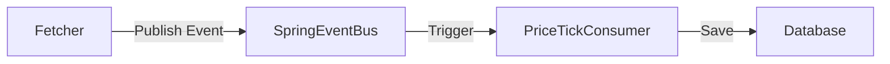
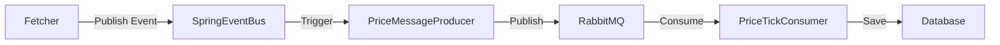

# Phase 6 Walkthrough: External Decoupling with RabbitMQ

## Overview
In Phase 6, we moved from an internal, synchronous event system (Spring Events) to an external, asynchronous message broker (RabbitMQ). This decoupling allows the ingestion of price ticks to scale independently of the persistence/processing logic.

## Architecture Changes

### Before (Phase 5)

All running in the same JVM, mostly synchronous.

### After (Phase 6)

The link between Producer and Consumer is now asynchronous and distributed.

## Key Components

### 1. RabbitMQ Configuration (`RabbitMqConfig.java`)
We set up a **Topic Exchange** (`crypto.prices.exchange`) and a **Queue** (`crypto.prices.queue`). The queue binds to the exchange with the pattern `prices.tick.#`, meaning it receives all tick messages. We use a JSON message converter to transmit `PriceTick` objects as JSON.

### 2. Producers
We implemented two producers to demonstrate the evolution of the code:

*   **`ManualPriceMessageProducer.java`**:
    *   **Purpose:** Educational. Shows how to use the low-level AMQP client (`Connection`, `Channel`, `basicPublish`).
    *   **Profile:** Active only with `-Dspring.profiles.active=manual`.
    *   **Lesson:** "Feeling the pain" of managing resources and serialization manually.

*   **`PriceMessageProducer.java`**:
    *   **Purpose:** Production. Uses Spring's `RabbitTemplate`.
    *   **Profile:** Active by default.
    *   **Implementation:** Simply calls `rabbitTemplate.convertAndSend(...)`.

### 3. Consumer (`PriceTickConsumer.java`)
The consumer was refactored. The `@EventListener` annotation was replaced with `@RabbitListener`.
```java
@RabbitListener(queues = RabbitMqConfig.QUEUE_NAME)
public void handlePriceTickMessage(PriceTick tick) {
    priceTickRepository.save(tick);
}
```
Spring Boot automatically handles the connection, thread pooling for listeners, and message deserialization.

### 4. Service Logic Update (`PriceServiceImpl.java`)
Moving to async persistence introduced a **Race Condition**:
1.  Service triggers fetch.
2.  Fetcher publishes event.
3.  Producer sends to RabbitMQ.
4.  **Service queries DB immediately.**
5.  Consumer receives from RabbitMQ and saves to DB.

Often, step 4 happened before step 5, resulting in stale data.
**Fix:** The service now uses the *fresh ticks returned by the fetcher* for the immediate API response, ignoring the DB for the "Real-Time Quote" endpoint. The DB is populated in the background for historical analysis.

### 5. Docker Support
We added Docker support to easily spin up the environment.
*   **`Dockerfile`**: Builds the Java application.
*   **`docker-compose.yml`**: Spins up a RabbitMQ container and the Application container, linked together.

## How to Run
1.  **Standard Mode**:
    ```bash
    docker-compose up --build
    ```
    This starts RabbitMQ and the App.

2.  **Manual Mode (Educational)**:
    Modify `docker-compose.yml` to set `SPRING_PROFILES_ACTIVE=manual` or run locally:
    ```bash
    ./mvnw spring-boot:run -Dspring-boot.run.profiles=manual
    ```
    You will see logs from the `ManualPriceMessageProducer`.

## Testing
Integration tests were updated to mock the RabbitMQ infrastructure (`TestRabbitConfig`), ensuring the logic holds even without a running broker during the build process.
